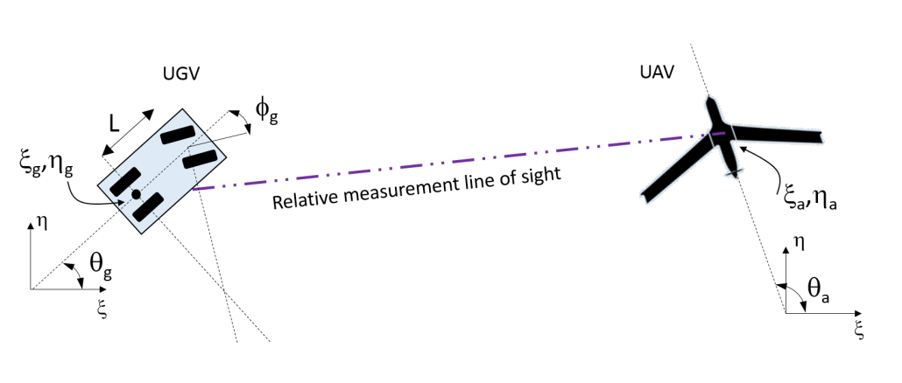
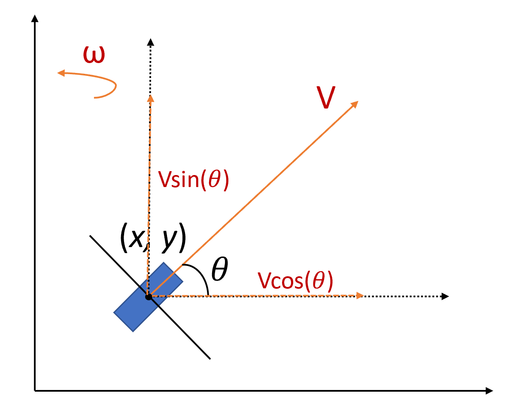

# UAV-UGV Cooperative Localization via Extended Kalman Filter

**Course:** AEM5451 Optimal Estimation
**Collaborators:** Michael States, Aditya Bidwai

---

## Overview

This project implements cooperative localization for a UAV-UGV system using an Extended Kalman Filter (EKF). The UGV has no GPS, so it relies on bearing and range measurements to the UAV (which does have GPS) along with its own motion model to estimate its position. The EKF fuses all available sensor information to jointly estimate the full 6D state of both vehicles.

---

## Table of Contents

- [Physical Setup](#physical-setup)
- [State, Input, and Measurement Definitions](#state-input-and-measurement-definitions)
- [System Dynamics](#system-dynamics)
- [Measurement Model](#measurement-model)
- [Algorithm: Extended Kalman Filter](#algorithm-extended-kalman-filter)
- [Validation: NEES and NIS](#validation-nees-and-nis)
- [Code Structure](#code-structure)
- [File Descriptions](#file-descriptions)
- [Running the Code](#running-the-code)
- [Key Parameters](#key-parameters)
- [Outputs](#outputs)

---

## Physical Setup



Two vehicles operate in a 2D East-North plane:

**UGV (Ground Robot):**
- Follows a bicycle/Ackermann steering model
- Drives at constant speed with a fixed steering angle, tracing a circular arc
- Has no absolute position sensor; localizes only through cooperative sensing

**UAV (Drone):**
- Point-mass model with constant forward velocity and turning rate
- Also traces a circular arc
- Provides GPS-grade absolute position measurements

Both vehicles observe relative geometry to each other (bearing and range), creating a mutually constrained estimation problem.

---

## State, Input, and Measurement Definitions

### State Vector (6D)

$$\mathbf{x} = \begin{bmatrix} \xi_g & \eta_g & \theta_g & \xi_a & \eta_a & \theta_a \end{bmatrix}^\top$$

| Symbol | Description | Units |
|--------|-------------|-------|
| $\xi_g$ | UGV East position | m |
| $\eta_g$ | UGV North position | m |
| $\theta_g$ | UGV heading (from East, CCW+) | rad |
| $\xi_a$ | UAV East position | m |
| $\eta_a$ | UAV North position | m |
| $\theta_a$ | UAV heading (from East, CCW+) | rad |

### Input Vector (4D)

$$\mathbf{u} = \begin{bmatrix} v_g & \phi_g & v_a & \omega_a \end{bmatrix}^\top$$

| Symbol | Description | Value |
|--------|-------------|-------|
| $v_g$ | UGV speed | 2 m/s |
| $\phi_g$ | UGV steering angle | $-\pi/18$ rad ($-10°$) |
| $v_a$ | UAV speed | 12 m/s |
| $\omega_a$ | UAV turn rate | $\pi/25$ rad/s |

Both inputs are held constant throughout the simulation.

### Measurement Vector (5D)

$$\mathbf{y} = \begin{bmatrix} \gamma_{ga} & r_{ga} & \gamma_{ag} & \xi_a & \eta_a \end{bmatrix}^\top$$

| Symbol | Description | Formula |
|--------|-------------|---------|
| $\gamma_{ga}$ | Bearing from UGV to UAV (relative to UGV heading) | $\text{atan2}(\eta_a - \eta_g,\; \xi_a - \xi_g) - \theta_g$ |
| $r_{ga}$ | Range between UGV and UAV | $\sqrt{(\xi_a-\xi_g)^2 + (\eta_a-\eta_g)^2}$ |
| $\gamma_{ag}$ | Bearing from UAV to UGV (relative to UAV heading) | $\text{atan2}(\eta_g - \eta_a,\; \xi_g - \xi_a) - \theta_a$ |
| $\xi_a$ | UAV East position (GPS) | direct |
| $\eta_a$ | UAV North position (GPS) | direct |

All angle measurements are wrapped to $[-\pi,\, \pi]$.

---

## System Dynamics

### UGV: Bicycle (Ackermann) Model

$$\dot{\xi}_g = v_g \cos\theta_g, \qquad \dot{\eta}_g = v_g \sin\theta_g, \qquad \dot{\theta}_g = \frac{v_g}{L}\tan\phi_g$$

where $L = 0.5$ m is the wheelbase. The heading rate depends nonlinearly on the steering angle, giving the vehicle its characteristic circular path.

### UAV: Dubins Unicycle Model



$$\dot{\xi}_a = v_a \cos\theta_a, \qquad \dot{\eta}_a = v_a \sin\theta_a, \qquad \dot{\theta}_a = \omega_a$$

The UAV follows a Dubins unicycle model: it moves at constant forward speed $v_a$ in the direction of its heading $\theta_a$, with the heading evolving at a constant angular rate $\omega_a$. Position couples nonlinearly through $\cos\theta_a$ and $\sin\theta_a$.

### Compact Form

$$\dot{\mathbf{x}} = f(\mathbf{x}, \mathbf{u}) \qquad \text{(continuous-time, nonlinear)}$$

$$\mathbf{x}_k = f_d(\mathbf{x}_{k-1},\, \mathbf{u},\, \mathbf{w}_{k-1}), \quad \mathbf{w} \sim \mathcal{N}(\mathbf{0}, Q) \qquad \text{(discrete-time)}$$

$$\mathbf{y}_k = h(\mathbf{x}_k,\, \mathbf{v}_k), \quad \mathbf{v} \sim \mathcal{N}(\mathbf{0}, R) \qquad \text{(measurement)}$$

Discrete propagation uses MATLAB's `ode45` integrator at each time step ($\Delta t = 0.1$ s) with tight tolerances (RelTol = AbsTol = $3 \times 10^{-14}$).

---

## Measurement Model

The measurement function $h(\mathbf{x})$ is nonlinear in the state:

- **Bearing** uses $\text{atan2}$: nonlinear, sensitive to quadrant
- **Range** uses Euclidean distance: nonlinear, always positive
- **UAV GPS positions** are direct (linear) but noisy

This nonlinearity prevents use of a standard linear Kalman filter and motivates the EKF.

---

## Algorithm: Extended Kalman Filter

The EKF linearizes the nonlinear dynamics and measurement functions around the current estimate at every time step, then applies the standard linear Kalman update.

### Jacobians

**State transition Jacobian** ($6 \times 6$):

$$A = \frac{\partial f}{\partial \mathbf{x}} \implies F_k \approx I + A\,\Delta t$$

Key nonzero entries come from the trigonometric terms in the dynamics:

$$\frac{\partial \dot{\xi}_g}{\partial \theta_g} = -v_g \sin\theta_g, \quad \frac{\partial \dot{\eta}_g}{\partial \theta_g} = v_g \cos\theta_g, \quad \frac{\partial \dot{\xi}_a}{\partial \theta_a} = -v_a \sin\theta_a, \quad \frac{\partial \dot{\eta}_a}{\partial \theta_a} = v_a \cos\theta_a$$

**Measurement Jacobian** ($5 \times 6$):

$$H_k = \frac{\partial h}{\partial \mathbf{x}}$$

Rows 1-3 (bearing and range) have nonzero entries coupling UGV and UAV positions. Rows 4-5 (UAV GPS) reduce to $\begin{bmatrix}0 & 0 & 0 & 1 & 0 & 0\end{bmatrix}$ and $\begin{bmatrix}0 & 0 & 0 & 0 & 1 & 0\end{bmatrix}$.

### Prediction Step

$$\bar{\mathbf{x}}_k = f_d(\hat{\mathbf{x}}_{k-1},\, \mathbf{u}) \qquad \text{(propagate state via ODE45)}$$

$$\bar{P}_k = F_{k-1}\,\hat{P}_{k-1}\,F_{k-1}^\top + L\,Q\,L^\top \qquad \text{(propagate covariance)}$$

where $L = \Delta t \cdot I$ is the process noise coupling matrix.

### Update Step

$$S_k = H_k\,\bar{P}_k\,H_k^\top + R \qquad \text{(innovation covariance)}$$

$$K_k = \bar{P}_k\,H_k^\top\,S_k^{-1} \qquad \text{(Kalman gain)}$$

$$\Delta\mathbf{y}_k = \text{wrapToPi}\!\left(\mathbf{y}_k - h(\bar{\mathbf{x}}_k)\right) \qquad \text{(innovation, angles wrapped)}$$

$$\hat{\mathbf{x}}_k = \bar{\mathbf{x}}_k + K_k\,\Delta\mathbf{y}_k, \qquad \hat{P}_k = (I - K_k H_k)\,\bar{P}_k$$

**Angle wrapping is critical.** Without it, an innovation of e.g. $-3.1$ rad vs $+3.1$ rad would be treated as $6.2$ rad apart rather than $0.2$ rad, causing the filter to diverge. `wrapToPi()` is applied to bearing innovations and to heading states after every update.

### Noise Tuning

| Matrix | Diagonal values | Interpretation |
|--------|----------------|----------------|
| $Q$ (process) | $[0.08,\; 0.08,\; 0.006,\; 0.006,\; 0.006,\; 0.006]$ | Higher uncertainty on position, lower on heading |
| $R$ (measurement) | $[0.0225,\; 64,\; 0.04,\; 36,\; 36]$ | Bearings measured precisely; range and GPS noisier |
| $P_0$ (initial covariance) | $\text{diag}([1,\; 1,\; 0.2,\; 1,\; 1,\; 0.2])$ | 1 m position uncertainty, 0.2 rad heading uncertainty |

---

## Validation: NEES and NIS

A filter can produce estimates that look reasonable but be miscalibrated: overconfident ($P$ too small) or underconfident ($P$ too large). The standard statistical tests for this are NEES and NIS, computed over $N = 50$ Monte Carlo runs.

### NEES: Normalized Estimation Error Squared

Measures whether the state error is consistent with the filter's reported covariance:

$$\text{NEES}_k = (\mathbf{x}^{\text{true}}_k - \hat{\mathbf{x}}_k)^\top \hat{P}_k^{-1} (\mathbf{x}^{\text{true}}_k - \hat{\mathbf{x}}_k)$$

Averaged over $N$ runs, this should follow a $\chi^2(n)$ distribution. The 95% confidence interval is:

$$\left[\frac{\chi^2_{0.025,\, nN}}{N},\;\; \frac{\chi^2_{0.975,\, nN}}{N}\right]$$

where $n = 6$ is the state dimension. If the averaged NEES stays within this band, the filter is **consistent**.

### NIS: Normalized Innovation Squared

Measures whether the measurement innovation is consistent with the predicted innovation covariance $S_k$:

$$\text{NIS}_k = (\mathbf{y}_k - \hat{\mathbf{y}}_k)^\top S_k^{-1} (\mathbf{y}_k - \hat{\mathbf{y}}_k)$$

Should follow $\chi^2(p)$ with $p = 5$ (measurement dimension). Same 95% CI test applies.

If both NEES and NIS pass, the filter's uncertainty estimates are statistically trustworthy.

---

## Code Structure

```
uav_ugv_coop_localization/
│
├── codes/
│   │
│   ├── ── Main Scripts ──────────────────────────────────────────────
│   ├── main_compile.m          # Master script: runs full EKF pipeline
│   ├── main_for_jacobian.m     # Validates linearization / Jacobians
│   ├── main.m                  # Visualizes raw nonlinear dynamics
│   │
│   ├── ── System Dynamics ───────────────────────────────────────────
│   ├── f_nonlinear.m           # Continuous-time ẋ = f(x, u)
│   ├── f_km1.m                 # Discrete propagation via ODE45
│   ├── ODEs_f_km1.m            # ODE right-hand side for f_km1
│   ├── calc_nom_traj.m         # Analytical nominal (circular) trajectory
│   │
│   ├── ── Measurement Model ─────────────────────────────────────────
│   ├── h_measure_nl.m          # y = h(x)  (no noise)
│   ├── h_k.m                   # y = h(x) + v  (with noise)
│   │
│   ├── ── EKF ───────────────────────────────────────────────────────
│   ├── EKF.m                   # Main EKF algorithm
│   ├── calc_F_k.m              # State transition Jacobian F_k
│   ├── calc_H_k.m              # Measurement Jacobian H_k
│   ├── calc_L_k.m              # Process noise coupling L_k = Δt·I
│   ├── calc_M_k.m              # Measurement noise coupling M_k = I
│   ├── eval_jacobian.m         # Evaluates A, B, C at a given (x, u)
│   │
│   ├── ── Analysis ──────────────────────────────────────────────────
│   ├── nis_nees.m              # NEES/NIS consistency tests + plots
│   ├── gen_truth_data.m        # Monte Carlo ground truth generation
│   ├── wrapRadAngles.m         # Angle normalization to [-π, π]
│   │
│   └── ── Utilities ─────────────────────────────────────────────────
│       ├── const_struct.m      # All system parameters
│       ├── line_plot.m         # Generic subplot utility
│       └── cooplocalization_finalproj_KFdata.mat  # Saved noise parameters
│
├── README.md
└── LICENSE
```

---

## File Descriptions

### Main Scripts

| File | Purpose |
|------|---------|
| `main_compile.m` | Top-level script. Loads parameters, generates 50 MC truth runs, runs EKF on each, calls NEES/NIS, generates all plots. |
| `main_for_jacobian.m` | Standalone validation: computes $F$, $G$, $C$ via matrix exponential and verifies linearized dynamics match the true nonlinear system near the nominal trajectory. |
| `main.m` | Simulates and plots raw nonlinear dynamics (states + measurements) without any filter; useful for understanding system behavior. |

### System Dynamics

| File | Purpose |
|------|---------|
| `f_nonlinear.m` | Defines $\dot{\mathbf{x}} = f(\mathbf{x}, \mathbf{u})$: the ODE right-hand side for both vehicles. |
| `f_km1.m` | Discrete-time propagation: integrates `f_nonlinear` over $\Delta t$ via `ode45`, adds process noise, wraps angles. |
| `ODEs_f_km1.m` | Internal ODE function used by `f_km1`; includes noise injection. |
| `calc_nom_traj.m` | Computes the analytical closed-form circular nominal trajectory from constant inputs. Used as the EKF reference. |

### EKF

| File | Purpose |
|------|---------|
| `EKF.m` | Implements the full prediction-update loop. Accepts a full measurement sequence and returns state estimates, covariances, innovation covariances, and predicted measurements for all time steps. |
| `calc_F_k.m` | Computes $F_k \approx I + A\,\Delta t$ from the analytical Jacobian $A = \partial f / \partial \mathbf{x}$. |
| `calc_H_k.m` | Computes $H_k = \partial h / \partial \mathbf{x}$ analytically: a $5 \times 6$ matrix with nonzero entries for the $\text{atan2}$ and Euclidean distance rows. |
| `calc_L_k.m` | Returns $L_k = \Delta t \cdot I$: process noise coupling. |
| `calc_M_k.m` | Returns $M_k = I$: direct measurement noise coupling. |
| `eval_jacobian.m` | Evaluates $A$ (state Jacobian), $B$ (input Jacobian), and $C$ (output Jacobian) at a given operating point. Used for linearization validation. |

### Analysis

| File | Purpose |
|------|---------|
| `gen_truth_data.m` | Generates $N$ Monte Carlo runs: samples process and measurement noise, propagates truth state via `f_km1`, generates noisy measurements via `h_k`. |
| `nis_nees.m` | Computes and plots NEES and NIS over all MC runs with $\chi^2$ confidence bounds. |
| `wrapRadAngles.m` | Wraps angles to $[-\pi, \pi]$ to prevent discontinuities. |

### Utilities

| File | Purpose |
|------|---------|
| `const_struct.m` | Defines all parameters: vehicle geometry, initial conditions, inputs, noise covariances, timing, dimensions. Single source of truth. |
| `line_plot.m` | Flexible subplot helper supporting custom labels, axis limits, colors, line styles, and LaTeX rendering. |

---

## Running the Code

**Requirements:** MATLAB with the Statistics and Machine Learning Toolbox (for `chi2inv`).

### Full EKF Pipeline

Open and run `main_compile.m`. This will:
1. Load noise parameters from `cooplocalization_finalproj_KFdata.mat`
2. Initialize constants via `const_struct`
3. Compute the nominal trajectory
4. Run 50 Monte Carlo ground truth simulations
5. Run the EKF on each simulation
6. Compute NEES and NIS, generate all plots

Execution time is approximately 5-10 seconds.

### Jacobian Validation Only

Run `main_for_jacobian.m` independently. It verifies the linearization by comparing perturbed nonlinear dynamics against the linearized model around the nominal trajectory.

### Raw Nonlinear Dynamics

Run `main.m` to simulate and plot the open-loop nonlinear system without any filter applied.

---

## Key Parameters

| Parameter | Value | Description |
|-----------|-------|-------------|
| $L$ | 0.5 m | UGV wheelbase |
| $v_g$ | 2 m/s | UGV speed |
| $\phi_g$ | $-\pi/18$ rad | UGV steering angle |
| $v_a$ | 12 m/s | UAV speed |
| $\omega_a$ | $\pi/25$ rad/s | UAV turn rate |
| $\Delta t$ | 0.1 s | Discrete time step |
| $t_f$ | 200 s | Simulation duration |
| $N$ | 50 | Monte Carlo runs |
| $n$ | 6 | State dimension |
| $p$ | 5 | Measurement dimension |
| $m$ | 4 | Input dimension |

**Initial conditions:**

| Vehicle | $\xi_0$ (m) | $\eta_0$ (m) | $\theta_0$ (rad) |
|---------|-------------|--------------|------------------|
| UGV | 10 | 0 | $\pi/2$ |
| UAV | -60 | 0 | $-\pi/2$ |

---

## Outputs

Running `main_compile.m` produces the following plots:

1. **2D Trajectory:** Estimated vs. true paths for both vehicles in the East-North plane
2. **Heading vs. Time:** Estimated and true headings for UGV and UAV
3. **Estimation Error $\pm 2\sigma$:** Per-state error with $\pm 2\sigma$ confidence bounds from $\hat{P}_k$; errors should stay within bounds ~95% of the time
4. **NEES Plot:** Averaged NEES across 50 runs with 95% $\chi^2$ confidence interval
5. **NIS Plot:** Averaged NIS across 50 runs with 95% $\chi^2$ confidence interval
6. **Per-run comparisons:** Separate detailed plots for individual Monte Carlo runs

A well-tuned filter will show:
- Estimation errors consistently within $\pm 2\sigma$ bounds
- NEES and NIS traces staying within their $\chi^2$ confidence bands
